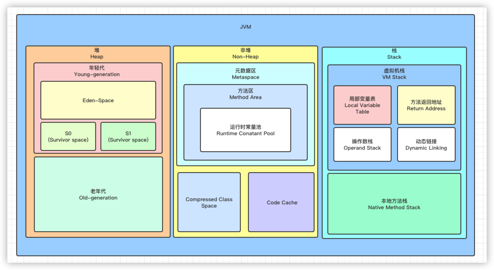

# 毕业项目
### 1. JVM 进阶

### 2. NIO 技术

### 3. 并发编程

### 4. Spring 和 ORM 等框架

### 5. MySQL 数据库和 SQL

### 6. 分库分表

### 7. 分布式服务

### 8. 分布式缓存

### 9. 分布式消息

### 10. 分布式系统架构

### 11. 业务系统重构

### 12. 架构师修炼之道

---
# 毕业总结

## 后续计划
* **课后作业**
    - [ ] Week 01
    - [ ] Week 02
    - [ ] Week 03
    - [ ] Week 04
    - [ ] Week 05
    - [ ] Week 06
    - [ ] Week 07
    - [ ] Week 08
    - [ ] Week 09
    - [ ] Week 10
    - [ ] Week 11
    - [ ] Week 12
    - [ ] Week 13
    - [ ] Week 14
    - [ ] Week 15
* **知识储备**
    - [ ] MySQL实战45讲 ***
    - [ ] SQL必知必会
    - [ ] Redis核心技术与实战 ***
    - [ ] 消息队列高手课
    - [ ] 深入拆解Java虚拟机 **
    - [ ] Java性能调优实战 **
    - [ ] 系统性能调优必知必会 **
    - [ ] Netty源码剖析与实战 ***
    - [ ] MongoDB高手课
    - [ ] 小马哥讲Spring核心编程思想 ***
    - [ ] 小马哥讲Spring AOP编程思想 ***
    - [ ] 代码精进之路
    - [ ] 设计模式之美 ***
    - [ ] 软件设计之美
    - [ ] Kafka核心技术与实战
    - [ ] Kafka核心源码解读
    - [ ] Nginx核心知识100讲
    - [ ] Zookeeper实战与源码剖析
    - [ ] Elasticsearch核心技术与实战
    - [ ] 高并发系统设计40问
    - [ ] 程序员的数学基础课
    - [ ] 数据结构与算法之美
    - [ ] 算法面试通关40讲
    - [ ] 动态规划面试宝典
    - [ ] 分布式协议与算法实战
    - [ ] 分布式数据库30讲
    - [ ] 分布式系统案例课
    - [ ] 即时消息技术剖析与实战
    - [ ] 趣谈Linux操作系统
    - [ ] Linux性能优化实战
    - [ ] 透视HTTP协议
    - [ ] 趣谈网络协议
    - [ ] 编译原理实战课
    - [ ] 推荐系统三十六式
    - [ ] 容器高手课
    - [ ] 浏览器工作原理与实践
    - [ ] 10x程序员工作法
    - [ ] 大厂晋升指南
    - [ ] 互联网人的英语私教课
    - [ ] 人人都用得上的写作课
    - [ ] 从零开始带你成为MySQL实战优化高手 **
    - [ ] 亿级流量电商详情页系统实战v2.0 **
    - [ ] C2C 电商系统微服务架构 120 天实战训练营
    - [ ] 100讲带你实战基于Redis的高并发预约抢购系统
    - [ ] 面试突击（一、二、三）季
